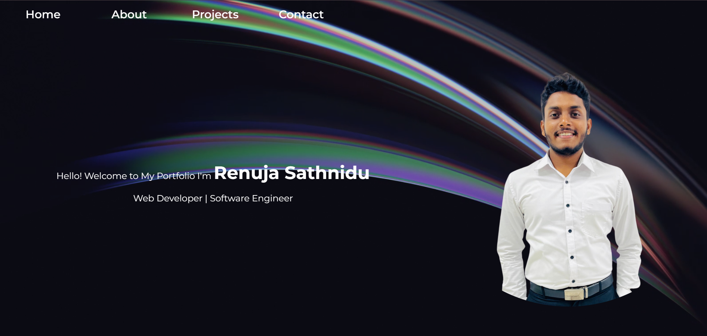

# 🌐 Renuja Sathnidu – Portfolio Website  

Welcome to my personal portfolio website! 🚀  
This project showcases who I am, what I do, and the projects I’ve worked on — all in one place.  

👉 **Live Demo**: [View on GitHub Pages](https://renujasathnidu.github.io/Portfolio---HTML-CSS/)  

---

## ✨ Features
- 🎥 **Video Background** on the homepage for a modern look  
- 🧑‍💻 **About Me** section to highlight skills & experience  
- 📂 **Projects Gallery** with descriptions  
- 📍 **Contact Section** with embedded Google Map  
---

## 🛠️ Tech Stack
- **HTML5** – structure  
- **CSS3** – styling & layout  
- **Font Awesome** – icons  
- **Google Fonts** – typography  

---

## 📸 Preview
  

---

## 🚀 Getting Started
Clone the repository and open `index.html` in your browser:

```bash
git clone https://github.com/RenujaSathnidu/Portfolio---HTML-CSS.git
cd Portfolio---HTML-CSS
